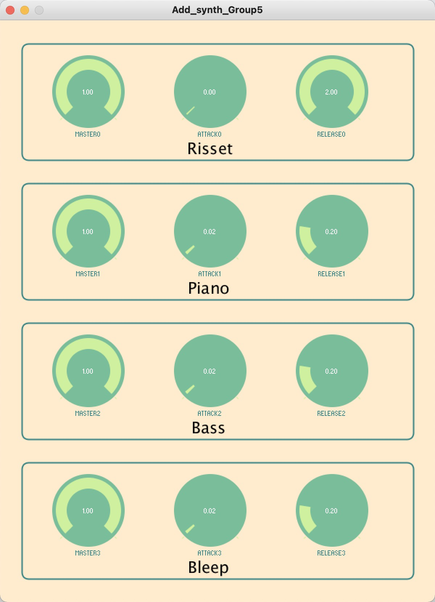

# Synthesizers

Here we describe the synth algorithms and their parameters.

## Initializing SuperCollider

In order to initialize the synthesizers in SuperCollider, we firstly boot the default server `s` with the command `s.waitForBoot`: this way, the whole code is processed only after the server is correctly booted, avoiding some problems we faced during the first development steps. Then, we initialize the parameters that we allow the user to play with and an empty array of 128 elements for polyphony. Lastly, the `MIDIClient.init` and `MIDIIn.connectAll` methods are called, for initializing the MIDI connections of the user's machine and connect them with SuperCollider, respectively.

## MIDI

In order to implement a polyphonic synthesizer, we initialized an empty array of 128 elements, one for each possible midi note number. When a key is pressed, the relative element in the array is filled with the synthesizer which is active, with the array resulting in an array of synthesizers. Moreover, we created two distinct global functions, called noteOnFunc and noteOffFunc that will be used in order to manage the info transmitted through MIDI when a key is pressed. Once every single function has been created, it is added to MIDIIn, through the addFuncTo command, as shown with the following lines of code:\ ` MIDIIn.addFuncTo(, \raisebox {-0.9ex} {\~}noteOnFunc);  IDIIn.addFuncTo(, \raisebox {-0.9ex} {\~}noteOffFunc);`\ We used Array.fill() to set the parameters of each instrument. It's the most important step in order to ensure the parameters to be the same as those adjusted in the GUI part.

## Synthesizer algorithms

As we previously mentioned, all the synthesis algorithm we implemented are based on additive synthesis, a sound synthesis technique that creates timbre by basically adding sine waves together. The timbre consist of multiple harmonic or inharmonic partials, with each partial which is a sine wave of different frequency and amplitude that swells and decays over time. Every synthesizer we have implemented is firstly defined through a `SynthDef`, where the template of the synth is defined, and then added to the server. Once the sound have been create combining different envelope and SinOsc Ugens, it is sent to the selected bus (we defined only the zero-th, with multichannel expansion that result automatically in a stereo image). Finally, we set the node relative to the playing synth free when it is not playing anymore with `DetectSilence.ar` method -we know it is not the best solution, but we encountered several problems with the different synth definition in set the nodes free on the server, and this solution is effective-.

### Risset Bell

Some of the first high-quality synthetic musical instrument tones using additive synthesis were developed in the 1960s by Jean-Claude Risset at AT&T Bell Telephone Laboratories. The Risset Bell algorithm, as the name suggests, is an additive synthesis algorithm which emulates the tone of a bell. Our implementation simulate the typical sound texture of the bell with a set of 11 sine tones with particular ratios in amplitude, duration, frequency and detuning which are clustered in a set of array-like variables, and we can also control the L/R panning. The final sound is obtained cycling through the arrays and selecting the *envelope* (amplitude, duration) and *tonal* (frequency, detuning) reference parameters.

### Piano

The piano algorithm is based on the superposition of thirteen sinewaves. The frequency of each partial is modulated through an envelope named `freq_env`, which results from the product between the fundamental frequency and `freq_var`, which is either a straight line or a bell-shaped line with curvature defined by the variable `speed`. The amplitude envelope of each sinusoid is determined by the same kind of operation, this time multiplying an ADSR envelope with `amp_var`. Finally, the signal is stereo-expanded with the `Splay` function and its gain is modulated with the `master` parameter.

### Bass

Another important algorithm we implemented is the bass synth. The bass synth , as done in previous parts, is made of thirteen sinewaves, each one of them has its own frequency and amplitude. Applying the same principle of the Piano section, the frequency of each partial is modulated by using the `freq_env` variable, which is obtained as the product between the fundamental frequency and the `freq_env`.Also for this section, the ADSR envelope is used in order to define the amplitude of each sinusoid. Moreover, such amplitude is defined multiplying the ADSR component with the `amp_var`. Then, the signal obtained passes through another passage, in which the input sound is stereo-expanded.

### Bleep

The fourth type of synth we implemented has been the Bleep synth. The frequency envelope of this type of synth is obtained as the product between the initial frequency (setted as default as 440Hz) and an XLine function which generates an exponential curve from the start value to the end value. Both the start and end values must be non-zero and have the same sign. In our code we also specified the speed of the curve, named with the *speed variable*. Then, the amplitude is defined as an Xline function, similar to the one we introduced before. Once the amplitude envelope has been realized, the signal is defined: obtained as the product between the envelope and the Blip.ar function: which is a Band Limited ImPulse generator. With this method,all harmonics have equal amplitude. Once the signal is obtained, the Pan2.ar method is called which realizes a two channel equal power pan.

# Interface

We made a window with dimensions of 600px\*800px to accommodate all our content, and write two function returnX() and returnY() to return the percentage of window length. After a series of calculations and making drafts, it was determined that we can divide this window into four sections, and the distance between each section is four percent of the window height. The width of each control button is twenty percent of the window width (120px) and the height is fifteen percent of the window height (120px) so that we can ensure that each control button is the right size and is squarely round. The colour scheme is green in the main body and beige in the background, which makes the whole console vivid and lovely. After a number of debugging sessions, the specific parameters of each colour were finally determined. `knobColorBackground` = color(207,240,158), `knobColorForeground` = color(121,189,154), `knobColorActive` = color(168,219,168), `knobColorCaptionLabel` = color(59,134,134).

Figure 1: The GUI part

# OSC

To make the Processing part and SuperCollider communicating, we decided to use the OSC communication protocol. First of all, we needed to import three libraries, ControlP5, NetP5 and oscP5. After initializing the osc variable as a New Osc component, we evaluated on SuperCollider the IP address of *NetAddress.localAddr*, and passing then these values to the new NetAddress variable called *myRemoteLocation* on Processing. Then we initialized a ControlP5 variable, called cp5, that we used to add some that we wanted to control, as the master knob, the attack knob, and the release knob. Defining these parameters in the cp5 component, made us able to pass them to SuperCollider with OSC so that we could set values directly from the interface. In the *ControlEvent* function of Processing, there's initalized a new OscMessage, which is passed through OSC to the OSCDef in SuperCollider. To this message, with *msg.add* are added all the knob parameters we wanted to control, so attack, release and master. Then the message is sent, and values are set and compiled in the SuperCollider class.

# Conclusions

We have developed four examples of additive synthesis in SuperCollider which the user can play with a MIDI keyboard. These are communicating via OSC protocol with a GUI where the player can modify on the fly amplitude, attack and release parameters of the four synths in a independent fashion, with the result of complex, layered sounds with interesting textures. Of course, the code could be further developed, adding more parameters for the player to tweak, and also we can add a set of effects -like reverb, delay- in order to make the sound even more interesting\... the possibilities offered by this Computer Music environments are all to be discovered, all that remains is to explore them!
=======
# CMLS_HW3_GROUP5
